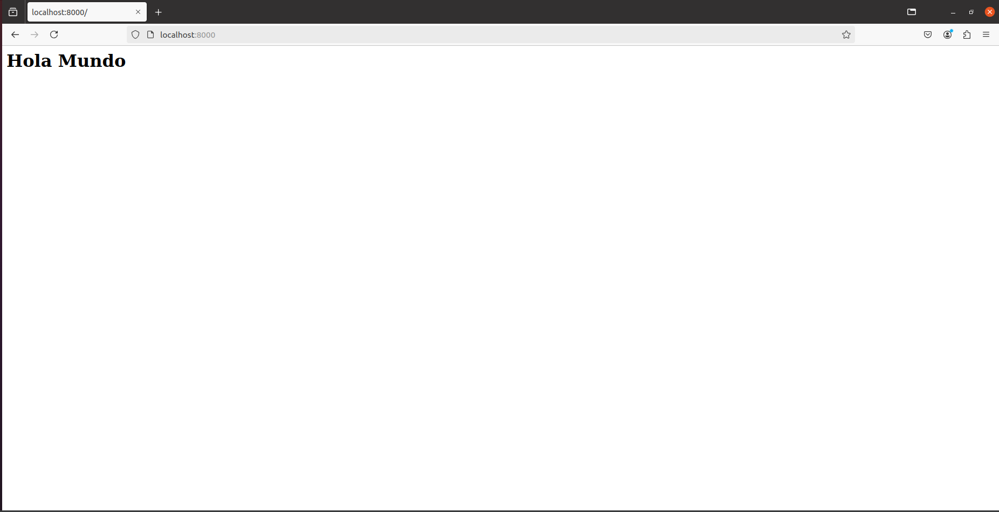
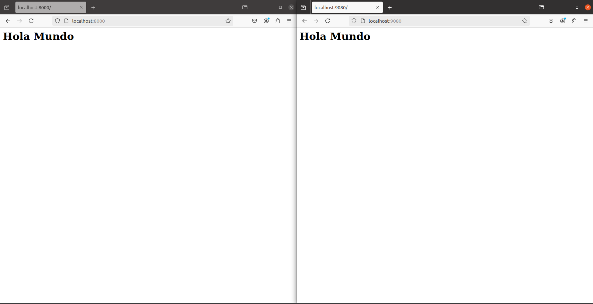

# Tarea_3

## 1. Descarga la imagen 'httpd' y comprueba que está en tu equipo.

Comando de descarga de la imagen:
```bash
sudo docker pull httpd:2.4
```
Salida:

2.4: Pulling from library/httpd
a480a496ba95: Pull complete 
3a2663e66670: Pull complete 
4f4fb700ef54: Pull complete 
dbde712f81fb: Pull complete 
867b2ea3628d: Pull complete 
6bd9d3710aae: Pull complete 
Digest: sha256:bbea29057f25d9543e6a96a8e3cc7c7c937206d20eab2323f478fdb2469d536d
Status: Downloaded newer image for httpd:2.4
docker.io/library/httpd:2.4

Comando de comprobación:
```bash
sudo docker images
```
Salida:

| REPOSITORY  | TAG   | IMAGE ID   | CREATED     |  SIZE  |
|    :---:    | :---: |   :---:    |   :---:     |  :---: |
|    httpd    |  2.4  |1bcf11fa154f|3 months ago | 148MB  |
| hello-world |latest |d2c94e258dcb|17 months ago| 13.3kB |

## 2. Crea un contenedor con el nombre 'dam_web1'.

Comando de creación de contenedor con el nombre indicado:
```bash
sudo docker run -d --name dame_web1 httpd:2.4
```
Salida:

e4eac173cbab4f92c7cb6738e2dc22bef0e961139e5e50b544960e7536093ffe

## 3. Si quieres poder acceder desde el navegador de tu equipo, ¿que debes hacer?. Utiliza bind mount para que el directorio del apache2 'htdocs' esté montado un directorio que tu elijas.

Primero de todo debes borrar los anteriores contenedores con estos dos comandos:
```bash
sudo docker stop dam_web1
sudo docker rm dam_web1
```
Salida de ambos:
 
dam_web1

Despues creas uno nuevo con las siguientes modificaciones:
```bash
sudo docker run -d --name dam_web1 -p 8000:80 -v ~/mi_directorio_apache:/usr/local/apache2/htdocs/ httpd:2.4
```
Salida:

d6db0bc66024afcffadc21b9d4aaa29575bd80c5b0be40487b732ae5941966d4

## 4. Realiza un 'hola mundo' en html y comprueba que accedes desde el navegador.

Para esto abres el editor de texto de ubuntu y pones "< h1 >Hola Mundo< / h1 >" despues lo nombras "index.html" y lo guardas en la carpeta elegida en el apartado 3.

La comprobación:



## 5. Crea otro contenedor 'dam_web2' con el mismo bind mount y a otro puerto, por ejemplo 9080.

El comando para la creacion del nuevo contendor seria esta:
```bash
sudo docker run -d --name dam_web2 -p 9080:80 -v ~/mi_directorio_apache:/usr/local/apache2/htdocs/ httpd:2.4
```
Salida:
c324867279d714cb9d8225ec3f44bceca3731fc87e0404336dff0436ba443263

## 6. Comprueba que los dos servidores 'sirven' la misma página.



## 7. Realiza modificaciones de la página y comprueba que los dos servidores 'sirven' la misma página

Realizo una modificacion con este comando (aunque se puede manualmente):
```bash
sudo echo "<h1>Hola Mundo Modificado</h1>" > ~/mi_directorio_apache/index.html
```
Sin Salida

Comprobación de ambos servidores:


